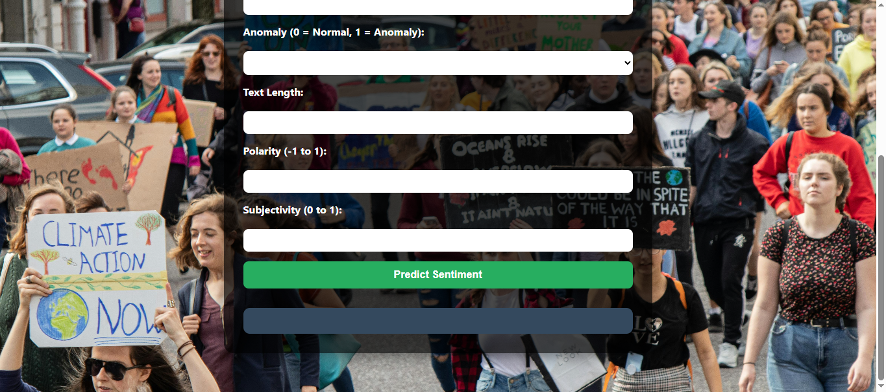

# 🌍 Climate Change Modeling Project

> This project is part of our ongoing **Data Analysis Series**, where we explore real-world datasets and progressively build beginner-to-advanced machine learning projects.  


## 📖 Project Overview  

The Climate Change Modeling Project aims to develop advanced machine learning models to predict and understand various aspects of climate change. This includes:  

- Predicting temperature anomalies  
- Detecting climate-related patterns in social media discussions  
- Understanding engagement trends in climate communication  
- Building models that can assist in future projections for planning and mitigation  

This project combines **tabular time-series data** (NASA’s historical global temperature anomalies) with **unstructured text data** (NASA Climate Change Facebook comments). By integrating NLP, sentiment analysis, time-series modeling, and feature engineering, we aim to build a holistic view of climate change indicators.  


## 📂 Repository Structure
```
/Climate_Change_Modelling_Project_FLASK_APP
│── app2.py                  # Flask application entry point
│── model.pkl               # Saved ML model
│── scaler.pkl              # Fitted scaler object
│── columns.pkl             # Saved training columns
│── tfidf.pkl               # Saved text vectorizer 
│── templates/
│     └── index.html        # Frontend HTML template
│── static/
│     └── style.css         # Custom CSS styling
│── requirements.txt        # Required dependencies
│── Climate_Change_Modeling.ipynb  # google colab Notebook 

```
---

## ⚙️ Step-by-Step Workflow (Notebook)

| **Step**                                    | **Sub-steps / Details**                                                                                                                                                                                                                                                                                    |
| ------------------------------------------- | ---------------------------------------------------------------------------------------------------------------------------------------------------------------------------------------------------------------------------------------------------------------------------------------------------------- |
| **Step 1: Data Collection & Exploration**   | - Import datasets <br> - Inspect structure, missing values, and data distribution                                                                                                                                                                                                                          |
| **Step 2: Data Cleaning & Preprocessing**   | - Clean `GLB.Ts+dSST` dataset (temperature anomalies) <br> - Clean `climate_nasa` dataset (FB comments) <br> - Merge datasets by time <br> - Basic statistics and descriptive summaries                                                                                                                    |
| **Step 3: Exploratory Data Analysis (EDA)** | - Distribution of likes & comments <br> - Time-series trend visualizations <br> - Monthly aggregations <br> - Posts vs. temperature anomaly distribution <br> - Anomaly detection trends <br> - Correlation heatmap <br> - Text preprocessing (stopwords, tokenization) <br> - WordCloud (Top 50 unigrams) |
| **Step 4: Feature Engineering**             | - Sentiment Analysis (VADER) <br> - TF-IDF vectorization of text <br> - Handle class imbalance with SMOTE <br> - Lag & rolling statistical features <br> - Encoding categorical variables (if required)                                                                                                    |
| **Step 5: Model Building**                  | - Train-test split (time-series aware) <br> - Outlier detection & handling <br> - Scaling features <br> - Model selection: Random Forest, XGBoost, Time-Series models <br> - Hyperparameter tuning                                                                                                         |
| **Step 7: Model Evaluation & Validation**   | - Time-series cross-validation <br> - SHAP for interpretability <br> - Feature importance plots                                                                                                                                                                                                            |
| **Step 8: Model Selection & Saving**        | - Save best-performing model <br> - Export supporting artifacts (`scaler.pkl`, `columns.pkl`) for deployment      |                        

---          

## 🌐 Web App Deployment (`Climate_Change_Modelling_Project_FLASK_APP`)

### 🔧 Flask Backend (`app2.py`)

* Loads the trained **Climate Change Sentiment Prediction** model (`Climate_Change_modelling.pkl`), scaler, and training feature columns
* Exposes two routes:
  * `/` → Renders the **frontend form** (`index.html`)
  * `/predict` → Accepts POST requests (JSON data), applies preprocessing (scaling, feature alignment), and returns the predicted sentiment as JSON
* Handles missing features gracefully by defaulting them to `0`
* Designed for deployment on local or cloud environments with `host="0.0.0.0"`

### 🏢 Frontend Interface (`templates/index.html`)

* Clean and user-friendly HTML form that collects input fields such as:
  * Likes Count
  * Comments Count
  * Anomaly (0 or 1)
  * Text Length
  * Polarity (-1 to 1)
  * Subjectivity (0 to 1)
* Uses JavaScript `fetch()` API to send form data to `/predict` and dynamically display results
* Maps numeric predictions to human-readable sentiment labels:
  * `0 → Negative`
  * `1 → Neutral`
  * `2 → Positive`

### 🎨 Styling (`static/style.css`)

* **External CSS file** for styling, separated from HTML
* Features:
  * Background image (`image.jpg`) with controlled zoom (`background-size: 120%`)
  * Centered form in a modern **glass-card style** container with shadows and rounded corners
  * Vibrant color scheme (`#f1c40f` titles, `#27ae60` buttons with hover transitions)
  * Responsive form with neat spacing and intuitive inputs
* Ensures good readability with semi-transparent dark overlay on forms

---


## 🛠️ Tools & Technologies Used

| Category              | Tools / Libraries                  |
| --------------------- | ---------------------------------- |
| Programming Language  | Python                             |
| Data Analysis & EDA   | Pandas, NumPy, Matplotlib, Seaborn |
| NLP & Text Processing | NLTK, VADER, Scikit-learn (TF-IDF) |
| Machine Learning      | Scikit-learn, XGBoost              |
| Time Series           | Statsmodels, Rolling/Lag features  |
| Model Explainability  | SHAP                               |
| Web Deployment        | Flask, HTML, CSS                   |
| Visualization         | WordCloud, Heatmaps, Line plots    |

---

## 🚀 How to Run the Project

1) Install Dependencies
   `pip install -r requirements.txt`

2) Run the Flask App
   `python app2.py`
- You will see:
 * Running on http://127.0.0.1:5000
 * Running on http://192.168.1.4:5000
3) Access the Web App
- Open your browser and go to:
`http://127.0.0.1:5000` or `http://192.168.1.4:5000`

---

## 🖼️ Web App Preview

> The interactive web UI can be previewed by running the Flask app and visiting: [http://192.168.1.4:5000](http://192.168.1.4:5000)

> **Screenshot:** 





---
## 📊 Model Performance Summary

| Model                 | RMSE (Train/Test) | R² (Train/Test) | Time-Series CV (Mean ± Std RMSE) | Notes                      |
| --------------------- | ----------------- | --------------- | -------------------------------- | -------------------------- |
| **Linear Regression** | 90.136            | -11274.539      | 72.4723 ± 79.4410                | Poor performance, underfit |
| **Decision Tree**     | 0.169             | 0.960           | 0.0957 ± 0.0832                  | Strong baseline            |
| **Random Forest**     | 0.031             | 0.999           | 0.0885 ± 0.0693                  | ✅ Best Model (saved)       |
| **XGBoost**           | 0.195             | 0.947           | 0.1142 ± 0.0942                  | Good, slightly behind RF   |
---
## 🔮 Future Enhancements

- Integrate deep learning models (LSTMs, Transformers) for text and time-series

- Build a dashboard in Streamlit or Dash for richer interactivity

- Expand dataset to include sea level rise, CO2 emissions, extreme weather data

- Deploy final model on cloud (AWS / Azure / GCP) for scalability
---
## 📌 Contribution Guidelines

- Fork the repository

- Create a new branch (feature-xyz)

- Commit your changes and push

- Submit a Pull Request for review

---

## 🙋‍♂️ Author

Made by Hashir khan   
Feel free to ⭐ the repo if you found it helpful!

